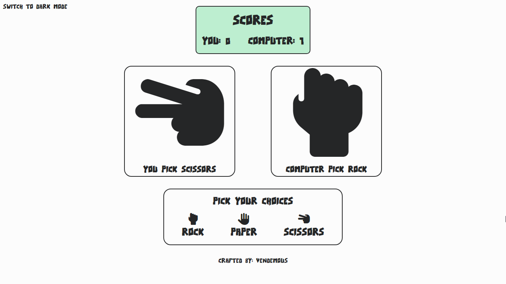
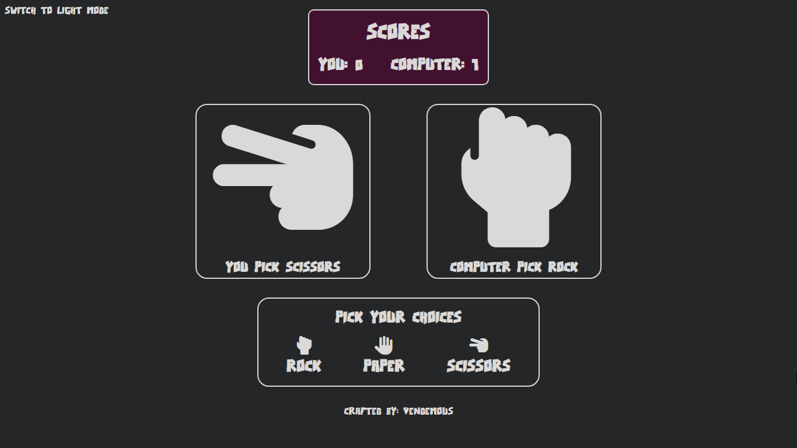
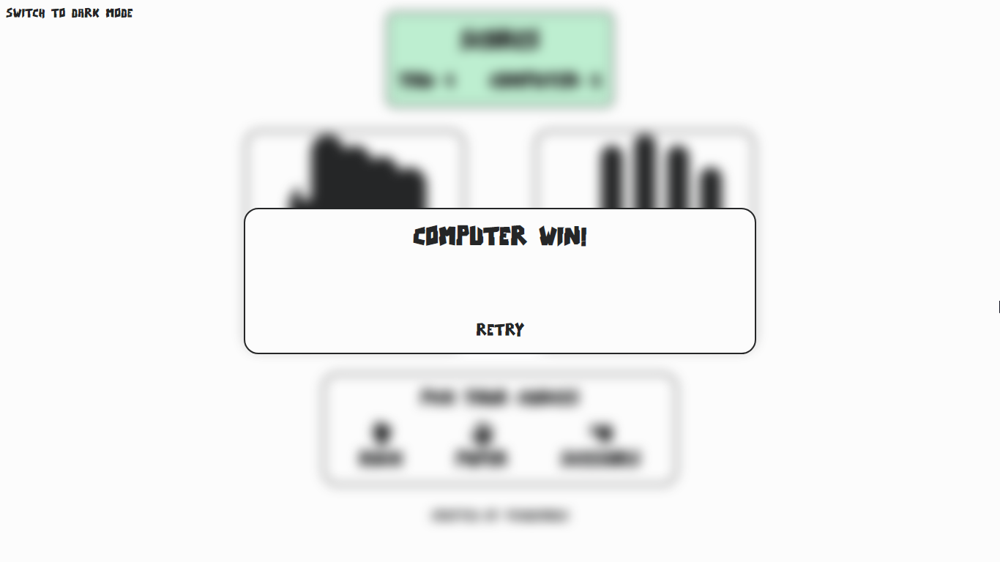
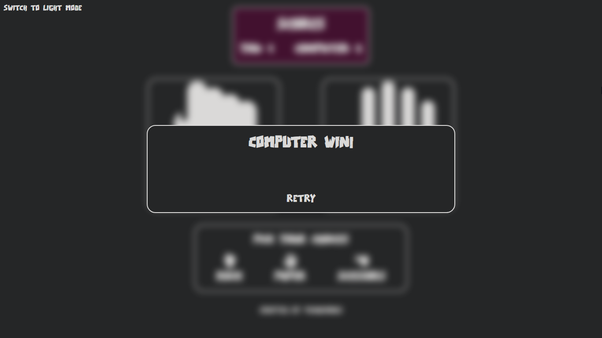

# rock-paper-scissors

A web-based classic rock paper scissors game 

## Features
* You can change the theme from light to dark and vice versa
* You will play with the computer ai
* The first one to get 5 points win

The computer only picks a random index from array of choices (rock, paper, scissors):

```javascript
const getRandomInt = (min, max) => {
  min = Math.ceil(min);
  max = Math.floor(max);

  return Math.floor(Math.random() * (max - min) + min);
};

const getComputerChoice = () => {
  const picks = ['rock', 'paper', 'scissors'];
  const randomIndex = getRandomInt(0, picks.length);
  
  return picks[randomIndex];
};
```

## Screenshots






